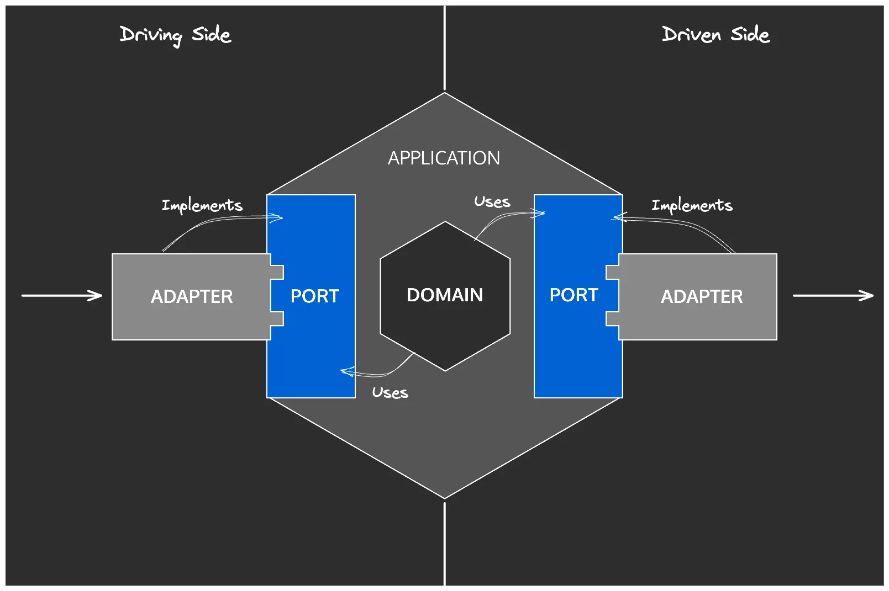

<!-- markdownlint-disable -->

ARCHITECTURE PATTERN
---

<!-- cmd:pause -->

We'll focus on _**some**_ of the rules of the Ports & Adapters architecture pattern.

<!-- cmd:pause -->



<!-- cmd:end_slide -->

PORTS & ADAPTERS
---

<!-- cmd:pause -->

# Quick Recap

<!-- cmd:pause -->

<!-- cmd:incremental_lists: true -->

- Domain Model
- Use Cases
- Application

<!-- cmd:incremental_lists: false -->

<!-- cmd:pause -->

- Ports: Driving | Primary | In
- Ports: Driven | Secondary | Out

<!-- cmd:pause -->

- Adapters: Driving | Primary | In
- Adapters: Driven | Secondary | Out

<!-- cmd:new_lines: 2 -->

<!-- cmd:pause -->

# Cardinal Rule

_**Dependencies go inwards!**_

<!-- cmd:end_slide -->

IMPLEMENTATION
---

<!-- cmd:pause -->

# What do these rules look like?

<!-- cmd:pause -->

```kotlin
@Testable
fun `domain model does not access...`()

@Testable
fun `ports do not access...`()

@Testable
fun `hubs can only access...`()
```

<!-- cmd:new_lines: 1 -->

<!-- cmd:pause -->

Now let's see how they're implemented side-by-side!

<!-- cmd:end_slide -->

SUMMARY
---

<!-- cmd:column_layout: [1, 1] -->

<!-- cmd:pause -->

<!-- cmd:column: 0 -->


<!-- cmd:new_lines: 1 -->

<!-- cmd:column: 1 -->


<!-- cmd:pause -->

<!-- cmd:column: 0 -->

<!-- cmd:new_lines: 2 -->

##### PROS

<!-- cmd:pause -->

• rich & stable feature set

<!-- cmd:pause -->

• detection of package cycles

<!-- cmd:pause -->

#### CONS

<!-- cmd:pause -->

• fluent Java API is verbose

<!-- cmd:pause -->

• classpath scan => JVM only

<!-- cmd:pause -->

• quite slow if misconfigured

<!-- cmd:new_lines: 0 -->

<!-- cmd:pause -->

<!-- cmd:column: 1 -->

<!-- cmd:new_lines: 2 -->

##### PROS

<!-- cmd:pause -->

• tailor-made for Kotlin

<!-- cmd:pause -->

• scans Kotlin files

<!-- cmd:pause -->

• knows language features

<!-- cmd:pause -->

• supports Android & KMP

<!-- cmd:pause -->

• extensive docs

<!-- cmd:pause -->

#### CONS

<!-- cmd:pause -->

• a few missing features

<!-- cmd:end_slide -->

RESOURCES
---

<!-- cmd:pause -->

## Repo

 &nbsp; [GitHub](https://github.com/franckrasolo/archunit-to-konsist)

<!-- cmd:pause -->

## Konsist Documentation

[Konsist](https://docs.konsist.lemonappdev.com/)

- Architecture Assertion
- Architecture Snippets
- Clean Architecture Snippets

<!-- cmd:pause -->

## YouTube

Dave Leeds: A Tour Through Konsist with Igor Wojda

󰗃 &nbsp; [Video](https://youtu.be/AlYTvzwZOc4)

<!-- cmd:end_slide -->

THANKS!
---

<!-- cmd:column_layout: [1, 1] -->

<!-- cmd:column: 0 -->

# Franck Rasolo

⏷ Principal Consultant

&nbsp; ▸ Platform Engineering

&nbsp; ▸ DevOps Enablement

&nbsp; ▸ Mentorship

<!-- cmd:new_lines: 1 -->

<!-- cmd:pause -->

 &nbsp;  &nbsp; 󰫑

[LinkedIn](https://linkedin.com/in/franckrasolo)

[Mastodon](https://mas.to/@franckrasolo)

<!-- cmd:column: 1 -->

<!-- cmd:pause -->

<!-- https://vfunction.com/blog/four-ways-software-architects-can-manage-technical-debt/ -->

> Architectural drift can quickly grow into architectural technical debt that no one wants to touch.

_-- Bob Quillin, vFunction_

<!-- cmd:new_lines: 1 -->

<!-- cmd:pause -->

###### _We're Clockwork!_ 🚀

<!-- cmd:pause -->

###### [clockwork.ing](https://clockwork.ing)


###### _Follow us on LinkedIn!_
